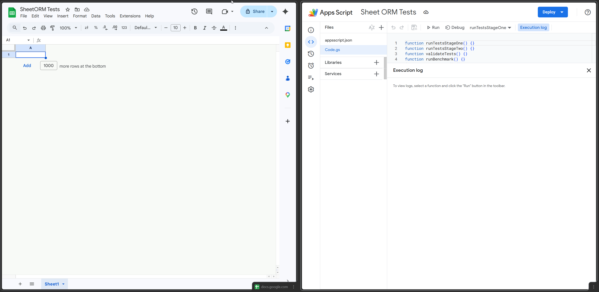

# SheetORM

<p>
  
</p>

A TypeScript ORM for Google Sheets running in Google Apps Script (GAS). SheetORM brings a structured,
type-safe persistence layer to spreadsheet-based applications with an **ActiveRecord** API — define a class,
extend `Record`, and everything just works.



## Features

- **ActiveRecord pattern** — Extend `Record`, define fields, and call `save()` / `find()` / `delete()`
  directly on instances and classes
- **Zero configuration** — Tables, schemas, indexes, and repositories are auto-created on first use
- **Predictable naming** — Sheet names follow `tbl_{ClassName}s` (e.g. `tbl_Cars`); combined index sheets
  follow `idx_{ClassName}s` (e.g. `idx_Cars`)
- **Fluent query builder** — `where()`, `and()`, `or()`, `orderBy()`, `limit()`, `offset()`
- **`Query.from()`** — Start queries from a class reference or string name
- **Secondary indexes** — Stored in a single combined index sheet (`idx_{ClassName}s`) for fast lookup by
  indexed fields
- **N-gram text search** — Solr-like trigram search on `@Indexed` fields via `IndexStore.searchCombined()`;
  also available as the `search` filter operator in queries
- **In-memory caching** — Configurable TTL cache to reduce sheet reads
- **Lifecycle hooks** — `beforeSave`, `afterSave`, `beforeDelete`, `afterDelete`
- **Batch operations** — `beginBatch` / `commitBatch` / `rollbackBatch` for safe bulk writes
- **Pagination & grouping** — `select()` returns `PaginatedResult<T>`, `groupBy()` returns `GroupResult<T>`
- **Sheet protection** — Auto-protect sheets on creation via `isProtected()` / `protectedFor()` overrides
- **Hidden sheets** — Auto-hide sheets on creation via `isHidden()` override; hidden sheets remain accessible
  from the "All sheets" menu
- **Zero runtime dependencies** — Bundles into a single `Code.js` via Vite

## Quick Start

### 1. Install & build

```bash
npm install
npm run build
```

### 2. Deploy to Google Apps Script

```bash
npm run login   # once per device
node scripts/publish-gas.mjs  # build + push + version (+ deploy if GAS_DEPLOYMENT_ID is set)
```

### 3. Define a model

Extend `Record` and declare fields as plain TypeScript properties. Use `@Indexed()` for indexed fields,
`@Required()` for required fields, and `@Field()` for extra options. Undecorated properties are
auto-discovered as fields.

```ts
import { Record } from "./src/core/Record";
import { Decorators } from "./src/core/Decorators";

const { Indexed, Required } = Decorators;

class Car extends Record {
  @Indexed()
  make: string;

  @Required()
  model: string;

  year: number;
  color: string;
}
```

- No `tableName` needed in the common case — the sheet name defaults to `tbl_` + class name + `s` (`Car` →
  `tbl_Cars`)
- When any field is decorated with `@Indexed()`, a combined index sheet is automatically created with the name
  `idx_` + class name + `s` (`Car` → `idx_Cars`). Classes without `@Indexed` fields do **not** get an index
  sheet.
- `@Indexed()` — marks a field as a secondary index (also implies `@Field`)
- `@Required()` — marks a field as required using concise decorator syntax
- `@Field(...)` — adds extra field options like `type`, `defaultValue`, or `referenceTable`
- Plain properties (`year`, `color`) — auto-discovered as schema fields with type inferred at runtime

If you want a custom sheet name, override the static getters:

```ts
class ArchivedCar extends Record {
  static override get tableName() {
    return "ArchivedCars";
  }

  static override get indexTableName() {
    return "idx_ArchivedCars";
  }
}
```

### 4. Protect a sheet

SheetORM can automatically protect auto-created sheets using the Google Sheets Protection API. Override
`isProtected()` and `protectedFor()` on your model class:

```ts
class SecretReport extends Record {
  @Required()
  title: string;

  body: string;

  static override isProtected(): boolean {
    return true;
  }

  static override protectedFor(): string[] {
    return ["alice@example.com", "bob@example.com"];
  }
}
```

When `isProtected()` returns `true`, the sheet is protected the first time it is created. The emails returned
by `protectedFor()` are added as editors — all other users (except the spreadsheet owner) are restricted to
view-only access. If `protectedFor()` returns an empty array, only the owner can edit.

Protection is applied **once** during sheet creation. Existing sheets are never re-protected on subsequent
saves.

### 5. Hide a sheet

SheetORM can automatically hide auto-created sheets from the bottom tab bar. Override `isHidden()` on your
model class:

```ts
class AuditLog extends Record {
  action: string;
  timestamp: string;

  static override isHidden(): boolean {
    return true;
  }
}
```

When `isHidden()` returns `true`, the sheet is hidden the first time it is created. The sheet tab is removed
from the bottom tab bar but remains accessible via the "All sheets" menu in Google Sheets.

Hiding is applied **once** during sheet creation. Existing sheets are never re-hidden on subsequent saves.

### Available decorators

SheetORM supports three TypeScript property decorators on `Record` models.

#### `@Required()`

Use `@Required()` when a field must be present before `save()` succeeds.

```ts
class Car extends Record {
  @Required()
  model: string;
}
```

This decorator is shorthand for `@Field({ required: true })`.

#### `@Field(options?)`

Use `@Field()` when you want to describe schema metadata explicitly.

```ts
class Car extends Record {
  @Field({ type: "date" })
  purchasedAt: Date;

  @Field({ type: "reference", referenceTable: "Owners" })
  ownerId: string;
}
```

Supported options:

| Option           | Type        | Description                              |
| ---------------- | ----------- | ---------------------------------------- |
| `required`       | `boolean`   | Rejects save when the field is missing   |
| `type`           | `FieldType` | Overrides runtime type inference         |
| `defaultValue`   | `unknown`   | Value used when the field is empty       |
| `referenceTable` | `string`    | Target table name for `reference` fields |

#### `@Indexed(options?)`

Use `@Indexed()` when the field should have a secondary index for faster lookups.

```ts
class Car extends Record {
  @Indexed()
  make: string;

  @Indexed({ unique: true })
  vin: string;

  @Indexed({ type: "date" })
  registeredAt: Date;
}
```

Supported options:

| Option   | Type                             | Description                      |
| -------- | -------------------------------- | -------------------------------- |
| `unique` | `boolean`                        | Enforces uniqueness in the index |
| `type`   | `"string" \| "number" \| "date"` | Controls index value typing      |

#### Plain properties without annotations

Not everything needs a decorator. Plain class properties are still discovered automatically and become normal
schema fields:

```ts
class Car extends Record {
  make: string;
  model: string;
  year: number;
}
```

Use decorators only when you need schema metadata or indexing behaviour.

### 6. Use it

```ts
// Create — table auto-created on first save
const car = new Car();
car.make = "Toyota";
car.model = "Corolla";
car.year = 2024;
car.color = "blue";
car.save();

// Or use the static factory
const civic = Car.create({ make: "Honda", model: "Civic", year: 2023, color: "white" });
civic.save();

// Fluent set + save (chainable)
new Car().set("make", "Honda").set("model", "Civic").set("year", 2023).save();

// Static queries — return typed Car[]
const toyotas = Car.where("make", "=", "Toyota").execute();
const found = Car.findById(car.__id);
const all = Car.find();

// Query.from() — class ref (typed) or string
const recent = Query.from(Car).where("year", ">=", 2023).orderBy("year", "desc").limit(10).execute();

// Update
car.color = "red";
car.save();

// Delete
car.delete();

// Count, pagination, grouping
Car.count();
Car.select(0, 10);
Car.groupBy("make");
```

See [`examples/cars-crud.ts`](examples/cars-crud.ts) for a complete runnable example.

## Architecture

```
src/
  core/Decorators.ts      — @Field, @Indexed, @Required property decorators
  core/Record.ts          — ActiveRecord base class (primary API); tableName = tbl_{Name}s, indexTableName = idx_{Name}s
  core/RecordConstructor.ts — Constructor contract for Record subclasses
  core/RecordStatic.ts    — Registry-facing static Record contract
  core/Registry.ts        — Global singleton: adapter, repos, class map
  core/SheetRepository.ts — Generic repository: CRUD, batch, hooks, cache
  core/types/             — One exported type / interface / class per file
    Entity.ts             —   Entity
    FieldType.ts          —   FieldType
    FieldDefinition.ts    —   FieldDefinition
    IndexDefinition.ts    —   IndexDefinition
    TableSchema.ts        —   TableSchema
    FilterOperator.ts     —   FilterOperator
    Filter.ts             —   Filter
    SortClause.ts         —   SortClause
    QueryOptions.ts       —   QueryOptions
    PaginatedResult.ts    —   PaginatedResult
    GroupResult.ts        —   GroupResult
    LifecycleHooks.ts     —   LifecycleHooks
    ISheetAdapter.ts      —   ISheetAdapter
    ISpreadsheetAdapter.ts —  ISpreadsheetAdapter
    ICacheProvider.ts     —   ICacheProvider
    SystemColumns.ts      —   SystemColumns
  query/Query.ts          — Fluent query API + Query.from()
  query/QueryEngine.ts    — filter, sort, paginate, group pipeline
  index/IndexMeta.ts      — Index metadata contract
  index/IndexStore.ts     — Secondary index management
  storage/GoogleSheetAdapter.ts — Native GAS sheet wrapper
  storage/GoogleSpreadsheetAdapter.ts — Native GAS spreadsheet wrapper
  core/cache/MemoryCache.ts — In-memory cache implementation
  utils/Uuid.ts           — UUID v4 generation (GAS / fallback)
  utils/Serialization.ts  — Row ↔ Entity conversion
  utils/SheetOrmLogger.ts — Verbose logger for API-call tracing
  testing/ParityCatalog.ts  — Canonical Jest ↔ runtime test case list
  testing/RuntimeParity.ts  — GAS runtime parity suite
  testing/RuntimeBenchmark.ts — GAS runtime benchmark (Cars + Workers, 1 000 records)
  SheetOrm.ts             — npm-facing aggregator for Record/Query/Decorators
  index.ts                — `GasEntrypoints` export for GAS globals
examples/
  cars-crud.ts            — Full ActiveRecord example
```

## API Reference

### Record (ActiveRecord base class)

Extend `Record` to define a model. Declare fields as plain class properties — they are auto-discovered. Use
decorators and an optional static property to customize behavior:

| Decorator / property          | Description                                                                     |
| ----------------------------- | ------------------------------------------------------------------------------- |
| `@Required()`                 | Shorthand for marking a field as required                                       |
| `@Field(options?)`            | Explicit field with options (required, type, defaultValue)                      |
| `@Indexed(options?)`          | Secondary index (implies `@Field`); auto-creates `idx_{ClassName}s`             |
| `static get tableName()`      | Sheet name (defaults to `tbl_{ClassName}s` — e.g. `tbl_Cars` for `Car`)         |
| `static get indexTableName()` | Combined index sheet name (defaults to `idx_{ClassName}s` — e.g. `idx_Cars`)    |
| `static isProtected()`        | Return `true` to protect the sheet on creation (default: `false`)               |
| `static protectedFor()`       | Email addresses of allowed editors (default: `[]`)                              |
| `static isHidden()`           | Return `true` to hide the sheet from the tab bar on creation (default: `false`) |

#### `@Required()`

Use `@Required()` when a value must be present before saving.

| Behavior            | Description                                                                |
| ------------------- | -------------------------------------------------------------------------- |
| Required validation | Rejects `save()` when the field is `undefined`, `null`, or an empty string |
| Equivalent form     | Same as `@Field({ required: true })`                                       |

#### `@Field` options

| Option           | Type        | Default     | Description                                                                |
| ---------------- | ----------- | ----------- | -------------------------------------------------------------------------- |
| `required`       | `boolean`   | `false`     | Reject saves when the value is missing                                     |
| `type`           | `FieldType` | auto-infer  | Explicit type (`string`, `number`, `boolean`, `date`, `json`, `reference`) |
| `defaultValue`   | `any`       | `undefined` | Value used when the field is empty                                         |
| `referenceTable` | `string`    | `undefined` | Target table for `reference` type fields                                   |

#### `@Indexed` options

| Option   | Type        | Default    | Description                     |
| -------- | ----------- | ---------- | ------------------------------- |
| `unique` | `boolean`   | `false`    | Enforce uniqueness in the index |
| `type`   | `FieldType` | auto-infer | Index value type                |

#### Auto-discovered fields

Any property declared on a `Record` subclass that is **not** a system column (`__id`, `__createdAt`,
`__updatedAt`) and is **not** a function is automatically treated as a schema field. Its type is inferred at
runtime from the value (`typeof`). You only need `@Field()` when you want to set options like `required` or an
explicit type.

> In this repository, examples use direct source imports such as `./src/core/Record`. The GAS bundle itself
> exposes callable globals through `GasEntrypoints`, not a general-purpose npm package surface.

#### Instance methods

| Method              | Returns   | Description                   |
| ------------------- | --------- | ----------------------------- |
| `save()`            | `this`    | Insert or update (chainable)  |
| `delete()`          | `boolean` | Delete from sheet             |
| `set(field, value)` | `this`    | Set a field value (chainable) |
| `get(field)`        | `unknown` | Get a field value             |
| `toJSON()`          | `object`  | Plain object with all fields  |

#### Static methods

| Method                            | Returns              | Description                           |
| --------------------------------- | -------------------- | ------------------------------------- |
| `create(data)`                    | `T`                  | Factory: create instance with data    |
| `findById(id)`                    | `T \| null`          | Find by primary key                   |
| `find(options?)`                  | `T[]`                | Find all (with optional filters/sort) |
| `findOne(options?)`               | `T \| null`          | Find first matching entity            |
| `where(field, op, value)`         | `Query<T>`           | Start a filtered query chain          |
| `query()`                         | `Query<T>`           | Start an empty query chain            |
| `count(options?)`                 | `number`             | Count matching entities               |
| `deleteAll(options?)`             | `number`             | Delete matching entities              |
| `select(offset, limit, options?)` | `PaginatedResult<T>` | Paginated query                       |
| `groupBy(field, options?)`        | `GroupResult<T>[]`   | Group by field                        |

### Query\<T\>

```ts
Car.where("make", "=", "Toyota")
  .and("year", ">=", 2020)
  .or("color", "=", "red")
  .orderBy("year", "desc")
  .limit(20)
  .offset(40)
  .execute(); // T[]
// .first()      // T | null
// .count()      // number
// .groupBy("field") // GroupResult<T>[]
```

Start from any class:

```ts
Query.from(Car).where("year", ">=", 2023).execute();
Query.from("Car").where("make", "=", "Toyota").first();
```

#### Query\<T\> methods

| Method                  | Returns            | Description                           |
| ----------------------- | ------------------ | ------------------------------------- |
| `and(field, op, value)` | `Query<T>`         | Add AND condition                     |
| `or(field, op, value)`  | `Query<T>`         | Add OR condition                      |
| `orderBy(field, dir?)`  | `Query<T>`         | Sort results (`"asc"` \| `"desc"`)    |
| `limit(n)`              | `Query<T>`         | Maximum number of results             |
| `offset(n)`             | `Query<T>`         | Skip first n results                  |
| `execute()`             | `T[]`              | Run query and return matching records |
| `first()`               | `T \| null`        | Return first matching record          |
| `count()`               | `number`           | Count matching records                |
| `groupBy(field)`        | `GroupResult<T>[]` | Group results by field                |

### Filter operators

`=`, `!=`, `<`, `>`, `<=`, `>=`, `contains`, `startsWith`, `in`, `search`

The `search` operator uses an in-memory **trigram (n-gram) index** built from the combined index sheet
(`idx_{ClassName}s`). When the target field is `@Indexed`, the query is optimised: candidates are narrowed via
the n-gram index first, then verified with a substring match. For non-indexed fields `search` falls back to a
simple case-insensitive `contains`.

```ts
// Fast n-gram search on @Indexed field — uses idx_Cars
const hits = Car.where("model", "search", "320i").execute();

// Programmatic access via IndexStore
const ids = indexStore.searchCombined("idx_Cars", "model", "320i");
```

### Field types

`string`, `number`, `boolean`, `json`, `date`, `reference`

## Testing

```bash
npm test
```

Runs **340 unit and benchmark tests** across 11 test suites using Jest + ts-jest with in-memory mock adapters:

| Suite                      | Tests | Description                                  |
| -------------------------- | ----- | -------------------------------------------- |
| `record.test.ts`           | 81    | ActiveRecord API (save, find, query, Query)  |
| `query-engine.test.ts`     | 60    | Filter, sort, paginate, group                |
| `serialization.test.ts`    | 47    | Row ↔ Entity conversion                      |
| `index-store.test.ts`      | 44    | Secondary index CRUD                         |
| `query.test.ts`            | 41    | Fluent query API                             |
| `sheet-repository.test.ts` | 35    | SheetRepository CRUD, batch, hooks           |
| `cache.test.ts`            | 16    | MemoryCache TTL behavior                     |
| `benchmark.test.ts`        | 6     | 1 000-record perf benchmark: Cars vs Workers |
| `uuid.test.ts`             | 5     | UUID generation                              |
| `parity-validator.test.ts` | 3     | Jest ↔ GAS runtime parity check              |
| `sheetorm.test.ts`         | 2     | npm entry point smoke tests                  |

### Benchmark Tests (`benchmark.test.ts`)

Two benchmark suites exercise the complete Record API against **1 000 records**:

| Suite             | Class    | Table         | Index sheet   | Notes                                |
| ----------------- | -------- | ------------- | ------------- | ------------------------------------ |
| Cars benchmark    | `Car`    | `tbl_Cars`    | `idx_Cars`    | All fields decorated with `@Indexed` |
| Workers benchmark | `Worker` | `tbl_Workers` | _not created_ | No `@Indexed` fields                 |

Both suites emit progress logs to stdout, covering every Record API operation: `save()`, `count()`,
`findById()`, `find()`, `findOne()`, `where()`, `query()`, `select()`, `groupBy()`, `update via save()`,
`set()/get()`, `delete()`, `deleteAll()`, `Query.from()`, `toJSON()`.

A timing comparison is printed at the end:

```
════════════════════════════════════════
BENCHMARK SUMMARY
════════════════════════════════════════
tbl_Cars  (with @Indexed):   311 ms
tbl_Workers (no @Indexed):   28 ms
Difference:                  283 ms
Faster suite: tbl_Workers (by 283 ms)
Note: in mock environment @Indexed adds write overhead (index sheet writes).
      In real Google Sheets, @Indexed enables faster lookups (fewer API reads).
════════════════════════════════════════
```

> **Note**: In the in-memory mock environment `@Indexed` adds write overhead (each indexed field value is
> written to the `idx_Cars` sheet). In real Google Sheets, `@Indexed` trades additional write cost for faster
> read lookups — beneficial when reading large datasets frequently.

### Jest ↔ GAS Runtime Parity (1:1)

Every Jest test has a matching handler in the GAS runtime parity suite. This ensures the library works
identically with real Google Sheets:

- `src/testing/ParityCatalog.ts` — canonical list of all Jest test cases
- `src/testing/RuntimeParity.ts` — runtime suite executing against real Sheets API
- `tests/parity-validator.test.ts` — fails when Jest and runtime cases diverge

Run locally (mock adapters):

```bash
npm test
```

Run in Google Apps Script (real Sheets API):

- `runTestsStageOne()` / `runTestsStageTwo()` / `runTestsStageThree()` / `runTestsStageFour()` — staged
  runtime parity suite
- `validateTests()` — validates mapping only (fast drift check)

### GAS Runtime Benchmark

A runtime benchmark mirrors `tests/benchmark.test.ts` and runs against the real Sheets API:

- `src/testing/RuntimeBenchmark.ts` — benchmark runner for Cars + Workers (100 records each)

Run in Google Apps Script (real Sheets API):

- `runBenchmark()` — executes full Cars + Workers benchmark and logs a timing summary

## Exposed GAS Functions

The following callable functions are surfaced as GAS globals (visible in the Apps Script editor Run menu and
callable as triggers). Everything else is an internal implementation detail bundled into `Code.js`.

| Function               | Purpose                                                                                          |
| ---------------------- | ------------------------------------------------------------------------------------------------ |
| `runTestsStageOne()`   | Stage-one parity tests: cache, index-store, query, query-engine (~162 tests).                    |
| `runTestsStageTwo()`   | Stage-two parity tests: serialization, uuid (~52 tests).                                         |
| `runTestsStageThree()` | Stage-three parity tests: record (~81 tests).                                                    |
| `runTestsStageFour()`  | Stage-four parity tests: sheet-repository (~35 tests).                                           |
| `validateTests()`      | Checks Jest ↔ GAS handler mapping parity — no Sheets API calls, fails immediately on drift.      |
| `runBenchmark()`       | Write/read/query/delete cycle for Cars + Workers (100 records each); logs per-operation timings. |
| `removeAllSheets()`    | Deletes every sheet in the active spreadsheet (destructive — use with caution).                  |
| `demoCreate()`         | Creates 5 sample DemoCar records in the sheet.                                                   |
| `demoRead()`           | Reads and logs DemoCar records using find/query/where.                                           |
| `demoUpdate()`         | Updates existing DemoCar records and logs changes.                                               |
| `demoDelete()`         | Deletes DemoCar records and verifies removal.                                                    |

## Available Scripts

| Script           | Description                                  |
| ---------------- | -------------------------------------------- |
| `npm run build`  | Clean + compile TypeScript + bundle via Vite |
| `npm test`       | Run all Jest tests                           |
| `npm run lint`   | Lint with ESLint                             |
| `npm run format` | Format with Prettier                         |
| `npm run login`  | Authenticate with Google Apps Script (once)  |

## Sheet Layout

Each registered table occupies one sheet. Row 1 contains headers: `__id`, `__createdAt`, `__updatedAt`,
followed by schema-defined fields. Data starts at row 2.

Special sheets:

- `tbl_{ClassName}s` — Data sheet (e.g. `tbl_Cars` for class `Car`)
- `idx_{ClassName}s` — Combined secondary index sheet (e.g. `idx_Cars`). Created automatically when the class
  has at least one `@Indexed` field. Columns: `[field, value, entityId]` — each row maps one indexed field
  value to its owning record. Classes with no `@Indexed` fields do **not** get an index sheet.

## Storage Adapters

SheetORM separates sheet I/O behind two interfaces defined in `src/core/types/ISheetAdapter.ts` and
`src/core/types/ISpreadsheetAdapter.ts`:

- **`ISpreadsheetAdapter`** — spreadsheet-level operations: `getSheetByName`, `createSheet`, `deleteSheet`,
  `getSheetNames`
- **`ISheetAdapter`** — sheet-level operations: read (`getAllData`, `getHeaders`, `getRow`, …), write
  (`appendRows`, `writeRowsAt`, `updateRow`, …), `clear`, `flush`

One production adapter pair is provided:

### `GoogleSpreadsheetAdapter` / `GoogleSheetAdapter`

**Location**: `src/storage/GoogleSpreadsheetAdapter.ts`, `src/storage/GoogleSheetAdapter.ts`

Uses the native GAS `SpreadsheetApp` / `Sheet` objects directly. This is the default adapter — no
configuration required.

```ts
import { GoogleSpreadsheetAdapter } from "./src/storage/GoogleSpreadsheetAdapter";
import { Registry } from "./src/core/Registry";

Registry.getInstance().configure({
  adapter: new GoogleSpreadsheetAdapter(), // uses active spreadsheet
});
// … or pass an explicit spreadsheet:
Registry.getInstance().configure({
  adapter: new GoogleSpreadsheetAdapter(SpreadsheetApp.openById("…")),
});
```

| Property            | Value                                                               |
| ------------------- | ------------------------------------------------------------------- |
| Write mechanism     | `Range.setValues()` — GAS native API                                |
| Calls per `saveAll` | **2** — one `setValues` for entity sheet + one for index sheet      |
| Flush required      | No — writes are synchronous and immediately visible                 |
| Quota impact        | Counts against SpreadsheetApp call budget (no daily UrlFetch quota) |
| Read operations     | Native `Range.getValues()`                                          |
| GAS V8 latency      | ~300–500 ms per `setValues` call on large ranges                    |
| Best for            | All production use; default choice                                  |

## Development Notes

### Exposing Functions to GAS

`src/index.ts` exports a single `GasEntrypoints` class. During bundling, the Vite GAS plugin maps its static
methods to GAS globals and emits matching stub functions so that Apps Script shows them in the Run menu.

GAS-callable methods include staged test runners (`runTestsStageOne`/`Two`/`Three`), `validateTests`,
`runBenchmark`, `removeAllSheets`, and four CRUD demos (`demoCreate`, `demoRead`, `demoUpdate`, `demoDelete`).
The class also exposes core API classes (`Record`, `Query`, `Decorators`, `IndexStore`, `Registry`,
`SheetOrmLogger`) as static readonly fields for use inside GAS scripts.

This keeps the source aligned with the repository rule of one public export per file.

### Circular Dependencies

Circular dependencies (files that depend on each other in a circular manner) can cause unexpected issues like
"X is not a function" or "X is not defined". If you are seeing these errors in your project and you know they
are wrong, try checking for circular dependencies using [`madge`](https://github.com/pahen/madge) (not
included in this template):

1. Install `madge` globally with `npm i --global madge`.
2. Check for circular dependencies with `madge src/index.ts --circular`.

## Security

To report a vulnerability, see [SECURITY.md](SECURITY.md). Do not open a public GitHub issue for security
issues — use GitHub's private Security Advisories instead.

## License

GPL-3.0-or-later — see [license.md](license.md).
